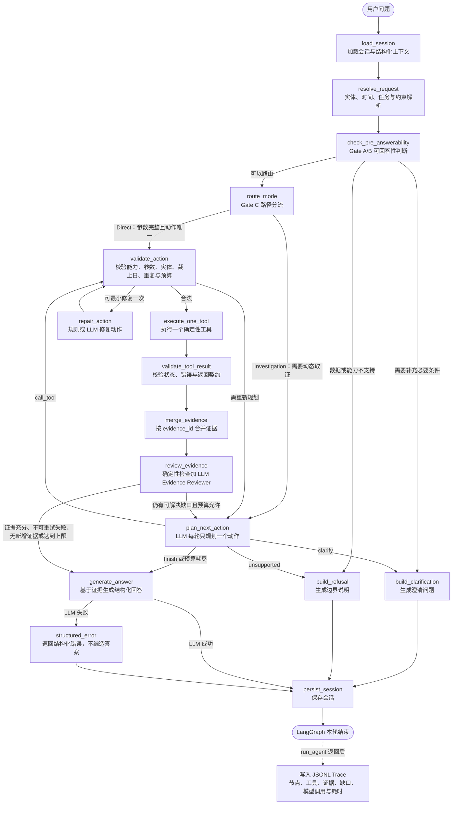

# FinTrace 在线 Agent、记忆、路由与证据工作流

## 总体模型

FinTrace 是“确定性 Harness + 受限 LLM 调查”的证据驱动 Agent：LLM 决定下一项待调查动作，程序决定可计算事实，证据决定可主张结论。系统不采用无限 ReAct，也不以多个自由对话 Agent 代替工具、规则和状态机。

```text
load context -> resolve request -> pre-answerability
  -> clarification / refusal
  -> direct action or bounded investigation
  -> action validation -> one tool execution -> result validation
  -> evidence merge -> evidence review -> answer -> persist context and trace
```

## 当前已实现并验证的运行拓扑

当前入口是 `harness.graph.workflow.run_agent(query, session_id)`，内部由 LangGraph `StateGraph` 编排 16 个节点。CLI 和 FastAPI 最终都调用这个入口。下图依据当前 `workflow.py`、`conditions.py` 和实际 Trace 绘制，不表示尚未实现的目标能力。



两条主路径的实际含义：

- **Direct Fast Path**：请求解析后能够构造唯一合法动作，不调用 Planner；工具结果仍必须经过结果校验、Evidence Ledger、证据审查和 Final Answer Skill。
- **Bounded Investigation**：Planner 每轮只产生一个 `AgentAction`，执行和审查后决定继续调查或回答；受 `max_steps`、`max_total_tool_calls`、无新增证据、不可重试错误及文档搜索次数等条件约束，不会无限 ReAct。
- **Clarification / Refusal**：缺少唯一必要条件时澄清，超出数据与能力边界时拒绝；两者均不应调用无关工具。
- **Structured Error**：最终回答模型失败时进入结构化错误节点，不使用确定性模板冒充模型回答。

### 2026-08-21 运行验证

| 验证层 | 输入或命令 | 结果 |
| --- | --- | --- |
| 完整自动化回归 | `F:\conda_envs\FinTrace\python.exe -m pytest -q` | `158 passed in 13.32s` |
| Direct 真机 | `600519.SH 2024年营业收入是多少` | 经过 11 个节点；1 次财务工具调用、1 条证据、1 次最终回答 LLM；`answered`，约 6.9 秒 |
| Investigation 真机 | `结合公告分析600519.SH的存货风险` | 经过 18 个节点；2 次受限文档检索、5 次 LLM 调用；检索无命中后以 `document_search_budget_exhausted` 正常终止，返回 `insufficient_evidence`，约 75.9 秒 |

因此，当前 Agent 的控制流、工具执行、证据审查、回答生成、会话保存和 Trace 落盘均可端到端跑通。调查场景“流程跑通”不等于“数据必然足以回答”：本次公告检索没有命中，系统正确暴露证据缺口而没有生成存货风险定论。Planner 本轮只选择了文档检索、未补充调用已有财务指标能力，属于后续需要通过评测改进的规划质量问题，不属于工作流中断。

## 会话与记忆

记忆分为四层：近期原文、结构化上下文、滚动摘要与已验证事实库。结构化上下文保存公司、人物、比较对象、日期、指标、任务及待澄清项；长期事实必须附证据 ID、来源、产生轮次、有效期和置信依据。模型猜测、失败结果和未经核验的数字不得写入长期记忆。

话题切换不应依赖固定清空提示，而由请求解析比较实体、时间和任务连续性决定。恢复历史时仅注入当前问题所需的最小上下文，并在 0.5M 累计历史压力下通过事实检索而不是整段回填保证召回。

## 请求解析与可回答性

请求解析依次产出：原始问题、显式与继承的实体候选、时间锚点/范围、任务族、指标/主题、约束和歧义。实体消歧必须返回可审计候选，不能在公司名称不唯一时默认选择。相对时间应相对会话时间或明确锚点解析。

可回答性状态分为：

- `supported`：数据和操作足以获得所需事实；
- `partially_supported`：仅部分子问题有可验证来源；
- `clarification_needed`：缺少主体、时间、比较对象或其他唯一条件；
- `unsupported`：系统没有对应数据、权限或能力；
- `unsafe_prediction`：请求要求预测、投资指令或不可验证判断。

在线回答状态另行记录 `answered`、`partially_answered`、`clarification_required`、`unsupported`、`insufficient_evidence`、`failed`，不得与离线评测标签混用。

`clarification_required` 只用于缺少的信息会导致主体、任务或比较维度无法唯一确定、因而不能可靠执行的情况。系统已经能够按确定性口径执行但覆盖不完整时，应执行并返回 `partially_answered`；工具运行后仍无核心证据时使用 `insufficient_evidence`，不能用澄清代替数据不足。

## 工具规划与校验

简单、参数完整、操作唯一的事实请求走确定性 Direct Gate。其余请求进入有界调查循环：每轮只规划一个 `AgentAction`，包含工具、操作、参数、目的和预期证据。动作校验器负责能力状态、参数、实体、时间、截止日、重复调用、预算和操作组合；失败时仅允许一次最小修复或重新规划。

工具层处理数值计算、日期过滤、图路径、文本检索和事件排序。LLM 不得自行计算财务公式、编造引用、以语言推断控制链，或绕过数据截止日。

综合财务风险调查先由 `financial_analysis.risk_scan` 返回v2逐期间观察值、状态、阈值和输入证据，再用 `event_timeline` 检查问询、处罚、更正和审计事件；只有用户需要原因、金额、解释或整改细节时，才将文档类型限定为 `announcement` 调用 `document_search`。`research_analysis` 仅在用户询问机构观点或 Reviewer 明确提出观点证据缺口时使用。`insufficient_data` 与 `not_applicable` 均不得表述为低风险；阈值未完成金标校准前不生成综合风险分。

风险期间由确定性解析器在Gate B前完成。一个用户目标期间扩展为截至该目标的全部同口径历史；未指定期间时优先采用截止日前全部可用年度，没有年度数据时选择数据最多的一组同口径中报或季报；多个明确期间保持原样。不同累计口径不会混合比较。只有一个可用期间时仍执行点时规则，跨期规则和连续性规则返回 `insufficient_data`，最终回答按覆盖情况降级。Action Validator要求工具参数与解析结果逐项一致，阻止LLM Planner写入示例年份或猜测年份。

补充核验工具返回 `DATA_NOT_AVAILABLE` 时表示当前数据源未命中，应记录为证据缺口并继续或降级回答；如果已有财务证据，不得因为事件或公告补充查询为空而抹掉整个风险分析结果。

事件查询先由 `event_timeline` 返回结构化节点、阶段、日期精度和公告证据。`event_cluster` 仅在共享文号或标题主题相似度达到阈值时合并同类型节点，并返回 `match_reasons`；跨类型关系只允许基于共享文号生成。需要处罚金额、事件原因或正文细节时，Agent继续调用 `document_search`，不得将标题摘要扩写成正文事实。空结果诊断可用于调整类型或时间条件，但“索引未命中”不能改写成“现实中从未发生”。

研报问题采用相同的分层模式。询问“机构如何评价、给出什么评级/预测/风险提示”时，先调用 `research_analysis.view_query` 获取带机构、日期、观点类型和来源定位的结构化观点；询问“为何得出该判断、原文如何论证、具体上下文是什么”时，Planner先取观点，再将研报类型过滤传给 `document_search`。若用户从一开始就只要原文片段，可直接检索。研报观点、研报引用事实和系统独立核实事实在 Evidence Ledger 中保持不同认识论状态，不得相互升级。

因此事件与研报共享同一决策骨架，但证据性质不同：公告标题事件是可追溯的事件节点候选；研报记录证明的是“某机构曾作出某项陈述”。二者的结构化工具负责高精度筛选，`document_search` 负责补充原文，不负责取代事件分类或观点归属。

## Evidence Ledger 与回答

Evidence Ledger 将每个工具结果规范为带 `evidence_id` 的事实单元，记录来源、对象、时间、原始定位、计算输入/公式、质量标记和限制。Evidence Reviewer 检查每个用户子问题是否已有充分且相互一致的证据；若否，明确证据缺口并在预算内继续调查或降级回答。

最终回答按事实、推论、机构观点和限制分层表达：事实必须能回指证据；推论必须陈述依据与不确定性；研报观点必须标明归属；风险信号不得写为造假定论。答案生成失败返回结构化错误而非模板化伪答案。

## Prompt、Trace 与治理

Prompt 正文、版本和装配唯一以 `prompts/` 为准。全局策略与当前 Skill 组合为系统提示，运行时上下文独立注入；能力注册表、工具 Schema、数据截止日和预算由程序动态提供，禁止硬编码进 Prompt。

每次模型调用记录 prompt ID/version、模型、温度、输入哈希、输出 schema 版本和延迟。每轮 Trace 记录解析结果、候选能力、动作历史、校验/修复、工具摘要、证据、缺口、终止原因和版本信息；不得记录或展示不可验证的私有推理链。
