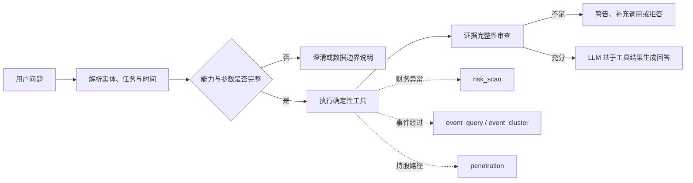

# 风险扫描、事件脉络与股权穿透开发计划

本文是三个待完善能力的实施工作文档：

1. `financial_analysis.risk_scan`：财务风险扫描 operation；
2. `event_timeline`：正式数据接入、事件查询、聚类与脉络组装；
3. `ownership_analysis.penetration`：有限股权穿透 operation。

本文描述开发顺序、数据产品、内部模块、工具契约、证据边界与验收方法。最终接口仍遵守项目统一的 `ToolCall -> ToolResult` 契约；LLM 负责理解问题和解释结果，不负责补造关系、财务数值、事件或因果关系。

## 实施状态（2026-08-21）

本文定义的首版能力已经实现：

- `risk_scan`：5 类版本化确定性规则，支持命中、未命中和输入不足三种状态；
- `event_timeline`：正式公告事件 SQLite、`event_query`、`event_cluster`，已删除 CSV/sample 回退；
- `penetration`：股东 v2 索引、唯一公司名称桥接、有界 BFS、逐跳证据和比例乘积；
- Agent：capability registry、规则 Planner、Action Validator、执行节点和 CLI 已接入。

当前v3事件索引从7,311条候选公告中排除544条否定陈述，形成6,767条标题级事件，其中2,861条识别出机构、15条识别出稳定文号。股权索引及实体桥接统计以各自最新manifest为准，不在本文复制易过期数字。上述统计均以各索引 `manifest.json` 为最终准据。

尚未完成的是后续增强项，不影响首版 operation 可用性：正文级 L2 事件抽取、`risk_scan` 的冻结财务风险金标 F1 评测、三层以上穿透金标扩充，以及风险/事件/股权的端到端复合评测。

## 1. 总体原则

### 1.1 离线构建与在线查询分离

原始 JSONL 只作为事实来源，不在每次问答时全量扫描。离线管道完成清洗、映射、规则所需指标准备、事件化和图边构建，在线工具只读取冻结的 SQLite/索引产物并执行确定性查询或计算。

### 1.2 三类结果采用同一证据纪律

- 原始事实必须指向稳定 `evidence_id` 和源记录；
- 派生结果必须记录输入证据、公式/算法及版本；
- 没有数据只能返回“数据中未发现”或“证据不足”，不能推断事实不存在；
- 财务异常只能称为风险信号，不能直接认定造假；
- 时间邻近或主题相似只能称为关联，不能自动写成因果；
- 主要股东快照只能证明快照覆盖范围内的持股边，不能冒充完整工商股权图谱。

### 1.3 LLM 与工具的职责边界

| 职责 | 确定性工具 | Agent LLM |
| --- | --- | --- |
| 查数、筛选、比较、路径搜索 | 负责 | 不自行计算或补数 |
| 阈值判断、比例乘积、事件排序 | 负责 | 不改写计算结果 |
| 解释风险信号和事件脉络 | 提供结构化输入 | 负责自然语言组织 |
| 数据不足提示 | 输出结构化 warning/error | 必须保留并明确告知用户 |
| 造假、控制、因果等强结论 | 不在证据不足时输出 | 不得越过工具证据边界 |

## 2. 财务风险扫描 `risk_scan`

### 2.1 目标与首版范围

`risk_scan` 在连续、可比的财务期间内执行已登记的跨科目勾稽规则，返回风险信号、逐期间观察值、计算输入、公式、阈值、严重度和证据。当前 `financial-risk-rules-v2` 不输出黑箱总分，不使用 LLM 判断规则是否命中，也不宣称识别出财务造假。

首版只基于当前 normalized 三张报表中已经确认映射的指标开发，优先实现：

| 规则 | 所需指标 | 核心判断 |
| --- | --- | --- |
| 利润与经营现金流背离 | 净利润、经营现金流 | 利润增长而经营现金流显著下降，或现金流/利润持续偏低 |
| 应收与收入背离 | 应收账款、营业收入 | 应收增速显著高于收入增速 |
| 存货与收入背离 | 存货、营业收入 | 存货增速显著高于收入增速 |
| 偿债压力 | 流动资产、流动负债、货币资金、总负债 | 流动比率、现金覆盖等指标触发已声明阈值 |
| 成本利润异常 | 营业收入、营业成本、营业利润 | 毛利率或营业利润率发生显著跨期变化 |
| 经营现金流持续为负 | 经营现金流 | 至少连续两个请求期间为负 |
| 销售收现与收入背离 | 销售收现、营业收入 | 收现收入比偏低或显著下降 |
| 资产负债率压力 | 总负债、总资产 | 负债率偏高或显著上升 |

只有当指标目录确实提供输入时才启用规则。非经常性损益、关联交易、审计意见、税务勾稽等缺少结构化字段的规则不得伪装成已实现；需要时由 `document_search` 或事件工具补充文本证据，但不混入首版确定性规则命中率。

### 2.2 输入契约

建议参数：

```json
{
  "operation": "risk_scan",
  "company_ids": ["600519.SH"],
  "report_periods": ["2020-12-31", "2021-12-31", "2022-12-31", "2023-12-31", "2024-12-31"],
  "rule_ids": ["CASH_PROFIT_DIVERGENCE", "RECEIVABLE_REVENUE_DIVERGENCE"],
  "focus_topics": ["earnings_quality"],
  "knowledge_cutoff": "2025-04-30"
}
```

- `company_ids`：首版只允许一个公司，避免多公司、多期间和多规则同时扩大结果歧义；
- `report_periods`：实际计算期间，至少一个；由确定性期间解析器从用户目标和SQLite可用期间产生，多个期间必须同口径；
- `requested_periods`：用户明确说出的期间，可为空或只有一个，不由Planner补造；
- `rule_ids`：可选，指定规则；不传则执行所有输入完整且适用的规则；
- `focus_topics`：可选的规则分组，不作为自由文本推理入口；
- `knowledge_cutoff`：只使用截止日前已披露的数据，由工作流注入，Planner 不得修改。

### 2.3 输出结构

```json
{
  "operation": "risk_scan",
  "company_id": "600519.SH",
  "periods_used": ["2023-12-31", "2024-12-31"],
  "signals": [
    {
      "signal_id": "...",
      "rule_id": "CASH_PROFIT_DIVERGENCE",
      "status": "triggered",
      "severity": "medium",
      "observations": [{"from": "2023-12-31", "to": "2024-12-31", "status": "triggered"}],
      "formula": "...",
      "thresholds": {},
      "calculated_values": {},
      "evidence_ids": []
    }
  ],
  "rules_evaluated": [],
  "rules_skipped": [],
  "coverage": {},
  "rule_version": "financial-risk-rules-v2",
  "threshold_calibration": {"status": "uncalibrated", "basis": "expert_initial"},
  "overall_score": null,
  "scoring_status": "disabled_until_calibrated"
}
```

规则状态区分 `triggered`、`not_triggered`、`insufficient_data` 和 `not_applicable`。不能只返回已命中的规则，否则无法区分“已检查未命中”“缺少输入”和“数值口径不适用”。增长和利润率规则逐相邻期间计算，流动性和杠杆规则逐期间计算；部分期间缺失时保留其他可评估观察值并披露缺口。

期间解析规则为：单个目标期间补齐截至目标的全部同类型历史；完全未指定时优先使用截止日前全部可用年度，没有年度数据时选择数据最多的一组同口径中报或季报；多个明确期间保持原样；只有单期数据时运行点时规则，并将跨期及连续性规则标为输入不足。CLI必须同时展示用户目标期间和实际计算期间。

现有数据没有冻结行业分类，人工风险金标也未完成，因此阈值仍是专家初值，不得宣称已行业校准。综合分保持关闭，直至独立开发集完成阈值校准且最终测试集保持隔离。

### 2.4 内部模块

建议在 `tools/financial_analysis/` 中增加：

- `risk_catalog.py`：规则 ID、版本、输入指标、适用期间和阈值定义；
- `risk_inputs.py`：从现有 Repository 批量取得规则输入并做口径检查；
- `risk_rules.py`：纯函数规则计算，不访问数据库、不调用 LLM；
- `risk_scan.py`：规则调度、覆盖率、跳过原因和结果汇总；
- `evidence.py`：在现有行级证据基础上增加派生信号证据链。

不建议把全部规则堆入 `interface.py`，也不建议用 Prompt Chain 替代规则函数。阈值集中配置并版本化，避免散落在代码和提示词中。

### 2.5 开发步骤

1. 盘点指标目录和数据缺失率，冻结首版可执行规则清单；
2. 为每条规则写“输入、口径、公式、阈值、跳过条件、输出含义”；
3. 实现批量取数、期间可比性校验和逐相邻期间观察值；
4. 以纯函数实现规则，明确零值、负值、缺失和不适用语义，并建立人工可计算的小样本金标；
5. 组装 `signals/coverage/evidence`，接入 `interface.py`；
6. 将 capability 标记为已实现，按“风险扫描→事件核验→公告原文”接入 Planner，并更新 Prompt、CLI 和工具 README；
7. 用冻结问题财报集评测信号级 Precision、Recall、F1，并单独评审报告表达。

### 2.6 测试与验收

- 单规则：命中、未命中、边界值、分母为零、负数、缺失值；
- 期间：FY 对 FY、Q1 对 Q1、不可比期间拒绝、披露日在截止日之后；
- 证据：每个计算输入均可追溯，公式与规则版本齐全；
- 集成：`risk_scan` 不再返回 `UNSUPPORTED_QUERY`，Planner 只在所需槽位完整时调用；
- 评测：以“公司 + 报告期 + 规则信号”为样本计算 F1，LLM 报告质量另做人工盲评，二者不能混为一个指标。

## 3. 事件时间脉络 `event_timeline`

### 3.1 当前问题与目标

当前已完成 `announcement-events-v3.1` 冻结索引、严格operation分发、否定陈述排除、事件阶段/监管机构/文号/主题签名抽取、可解释聚类、共享文号关系和空结果诊断，不再存在CSV或sample回退。仍待完成的是公告正文中的精确事件日期、金额、涉事人员和处理结果抽取，以及人工金标专项评测。

目标不是让 LLM 临时阅读全部公告后编时间线，而是先离线构建结构化事件库，在线完成查询、去重、排序和可解释聚类，再由 Agent 将工具结果组织为叙述。

### 3.2 事件来源

在现有数据边界内分三层建设：

| 层级 | 来源 | 可以主张的内容 |
| --- | --- | --- |
| L1 标题事件 | `announcements.jsonl` 的公司、标题、日期、类型等 | 某日发布了某公告 |
| L2 正文事件 | 公告 Document/Chunk 中可定位的明确事实 | 监管问询、处罚、诉讼、审计意见等有原文支持的事件 |
| L3 派生事件 | `holding_compare`、`risk_scan` 的确定性输出 | 主要股东快照变化或某规则在某期触发 |

研报只能作为机构观点或事件解释材料，不能直接升级为客观事件。首版建议优先完成 L1，并对任务指标关心的类型选择性补充 L2；L3 待另外两个 operation 稳定后再接入。

### 3.3 离线事件库

新增 `data_pipeline/events/`，建议包括：

- `build_events.py`：读取 normalized 公告并生成统一事件；
- `classify.py`：标题规则优先的可审计事件分类；
- `deduplicate.py`：按公司、规范标题、日期、来源文档去重；
- `build_index.py`：写入 SQLite 和 manifest；
- `README.md`：字段、命令、版本和质量限制。

在线产物建议为：

```text
data/indexes/event_timeline/events.sqlite
data/indexes/event_timeline/manifest.json
```

事件最小字段包括 `event_id`、`company_id`、`event_date`、`event_type`、`title`、`summary`、`related_entities`、`source_document_ids`、`evidence_ids`、`extraction_method`、`quality_flags`。`event_date` 与 `announcement_date` 若语义不同必须分别保存。

首版不必引入向量聚类或大型图数据库。结构化过滤和规则聚类能够覆盖明确类型；只有当人工评测证明同义标题漏聚类严重时，再考虑 embedding 作为候选召回，最终聚类仍保留可解释依据。

### 3.4 两个 operation 的边界

#### `event_query`

负责按公司、日期、事件类型和关键词筛选、去重、排序，返回原始事件节点。它不自动合并事件，不生成因果链。

建议输入：`entity_ids`、`start_date`、`end_date`、`event_types`、`keywords`、`limit`、`knowledge_cutoff`。

#### `event_cluster`

基于已经筛选出的公司和时间范围聚合相关事件，返回事件簇及成员节点。v3要求公司和事件类型一致、时间距离不超过窗口，并满足共享文号或规范标题相似度阈值；每个簇通过 `match_reasons` 保留依据和全部成员证据，不生成“导致”“引发”等无证据因果标签。

建议输入与 `event_query` 基本一致，额外允许 `window_days`，但设置合理上限。输出增加 `cluster_id`、起止日期、成员事件 ID、聚类依据、置信等级和证据 ID。

“整理时间脉络”通常先调用 `event_query`；只有结果中存在明显同一事项的多个进展节点时，再调用 `event_cluster`。Agent 根据排序后的节点或簇生成文字时间线，不需要再增加一个含义重叠的 `timeline_generate` operation。

### 3.5 在线实现调整

1. 删除正式模式的 sample 数据回退；索引缺失时返回 `DATA_NOT_AVAILABLE` 和构建命令；
2. 为 `event_query` 与 `event_cluster` 建立明确参数模型并严格分发；
3. Repository 在 SQL 层执行公司、日期、类型、截止日和 limit 过滤；
4. `event_query` 返回事件级证据，`event_cluster` 复用成员证据并增加聚类依据；
5. 将 `knowledge_cutoff` 应用于信息可见日期，而不是简单等同于事件发生日期；
6. CLI 分开显示“事件节点”和“相关事件簇”，避免把簇摘要当作新事实；
7. Agent 回答中保留“时间相关不等于因果”的限制说明。

### 3.6 测试与验收

- 构建：重复公告、空标题、非法日期、同标题不同公司、manifest 失效；
- 查询：日期边界、类型过滤、关键词、limit、空结果和截止日防前视；
- 聚类：应聚合、跨类型不聚合、时间过远不聚合、实体不重合不聚合；
- 证据：每个节点回到公告或派生工具证据，簇不丢成员；
- 性能：按竞赛口径只统计工具内部查询和结果组装，目标不超过 5 秒；
- 效果：在人工标注的公司时间窗内，以关键事件节点 Recall 为主，同时抽查错误合并率和时序是否断裂。

## 4. 股权穿透 `penetration`

### 4.1 数据边界与能力定义

当前 `shareholders.jsonl` 是上市公司的主要股东快照，不是完整工商股权库。它可以产生“股东 -> 被持股上市公司”的有向边；当某个企业股东本身也在数据集中作为上市公司出现时，才可能继续向上或向下形成多跳路径。

因此首版应命名和描述为“基于主要股东快照的有限持股路径搜索”，不能承诺完整实控人识别、最终受益人识别或所有三层以上隐性控制链。比赛目标与数据可证明范围之间的缺口应在答辩和评测中明确列出。

### 4.2 图数据模型

离线从已经标准化的股东快照投影两类数据：

- `entities`：实体 ID、规范名称、实体类型、证券代码和别名；
- `ownership_edges`：`holder_id -> company_id`、持股比例、持股数量、快照日、披露日、来源记录、排名和质量标志。

同一关系可能有多个快照，不能覆盖成一条“当前边”。在线查询先根据 `as_of_date` 和 `knowledge_cutoff` 为每个被持股公司选择当时可见的最近有效快照，再在该快照上构图。

首版继续使用 SQLite 即可：现有数据规模下，通过 `holder_id`、`company_id`、`snapshot_date`、`announcement_date` 索引批量扩展邻接边。无需为了“图谱”名称立即引入 Neo4j；Repository 接口保持独立，未来数据与查询规模证明需要时再替换存储。

### 4.3 输入契约

```json
{
  "operation": "penetration",
  "source_entity_id": "ENTITY-A",
  "target_entity_id": "600519.SH",
  "as_of_date": "2024-12-31",
  "max_depth": 4,
  "max_paths": 20,
  "knowledge_cutoff": "2025-04-30"
}
```

- `source_entity_id`：路径起点，可以是自然人、企业或其他已解析主体；
- `target_entity_id`：目标公司；
- `as_of_date`：关系观察时点，不得用最新快照回答历史问题；
- `max_depth`：建议默认 4、上限 6，防止无界搜索；
- `max_paths`：建议默认 10、上限 50；
- `knowledge_cutoff`：控制哪些披露在当时可见。

若用户只问“谁通过多层持有目标公司”而没有起点，不应让 `penetration` 穷举全图。先用 `holding_query` 得到候选主要股东，再由 Planner 对明确候选发起有限路径查询，或要求用户澄清目标主体。

### 4.4 路径算法

采用有界 BFS/DFS 均可，首版建议 BFS：优先找到跳数较少的路径，便于设置深度和数量上限。关键步骤如下：

1. 解析并确认起点、终点实体；
2. 按时点和截止日选择每家公司的有效快照；
3. 从起点按 `holder -> company` 方向扩展；
4. 用当前路径的实体集合防止环路，不使用全局 visited 错误剪掉另一条有效路径；
5. 到达目标后记录完整路径，达到 `max_paths` 或 `max_depth` 即停止；
6. 按跳数、完整性和路径比例排序；
7. 返回搜索覆盖、截断情况和数据覆盖警告。

简单链路的间接持股比例按每跳比例乘积计算：

```text
path_ratio = ratio_1 * ratio_2 * ... * ratio_n
```

多条独立路径可以逐条返回，但首版不直接相加为“总控制权”。交叉持股、重复路径、共同控制、表决权委托和一致行动关系都不能仅靠持股比例乘积解决，应明确标记为未建模。

### 4.5 输出结构

```json
{
  "operation": "penetration",
  "source_entity_id": "ENTITY-A",
  "target_entity_id": "600519.SH",
  "effective_as_of_date": "2024-12-31",
  "paths": [
    {
      "path_id": "...",
      "depth": 3,
      "nodes": [],
      "edges": [],
      "path_ratio": 0.125,
      "evidence_ids": []
    }
  ],
  "search_summary": {
    "expanded_nodes": 0,
    "max_depth_reached": false,
    "max_paths_reached": false
  },
  "coverage": {},
  "limitations": []
}
```

每条边必须包含持有人、被持股公司、比例、快照日、披露日和证据 ID。无路径时返回空 `paths` 和覆盖说明，文案只能是“在当前主要股东快照中未发现可证实路径”。

### 4.6 内部模块

建议在 `tools/ownership_analysis/` 中完善或增加：

- `graph_repository.py`：按时点批量取得邻接边；
- `graph.py`：有界路径搜索、环检测、路径排序；
- `penetration.py`：参数语义、有效快照、比例计算和覆盖汇总；
- `evidence.py`：复用每条 shareholder 行的证据并组装路径证据。

现有 `graph.py` 如仍与上述契约一致可以复用，但必须以真实 Repository 和证据模型验证，不能让样例图进入正式调用路径。

### 4.7 测试与验收

- 算法：直持、两跳、三跳以上、多路径、环、无路径、深度截断和路径数截断；
- 时点：历史快照、防前视、某一中间公司的快照缺失；
- 比例：每跳比例与乘积正确，缺失比例时路径可返回但乘积为 `null`；
- 实体：别名解析、同名主体冲突、起点或终点不存在；
- 证据：每一跳均有独立证据，路径证据不能只引用最终公司；
- 性能：将 Repository 查询和路径组装作为工具执行时间，目标不超过 5 秒；
- 专项评测：按完整案例判断每个节点、每一跳方向、比例和时点是否全部正确，只有整条链正确才计为端到端正确。

## 5. Agent 接入

三个能力实现后需要同步修改，而不是只开放接口：

1. `capability_registry.py` 将对应能力标记为 `implemented=True` 并填写真实 tool/operation/required slots；
2. Request Parser 能识别风险扫描、事件查询/聚类和股权穿透任务；
3. Planner Prompt 只看到已实现的契约、参数和数据限制；
4. Action Validator 校验 operation、基数、日期、深度上限及 `knowledge_cutoff`；
5. Evidence Reviewer 检查风险计算输入、事件来源或路径每一跳是否完整；
6. CLI 用表格/分步文本展示规则命中、事件节点和持股路径，不输出原始 JSON；
7. 评测日志记录 operation、参数、状态、证据 ID、错误和工具内部耗时。

建议的复合调查流程：



## 6. 推荐开发顺序

### 第一批：`risk_scan`

依赖最少，现有财务 SQLite、指标目录和证据链已经存在。先用 3 至 5 条高价值规则跑通“规则定义 -> 取数 -> 计算 -> 证据 -> F1 评测”闭环，不急于增加复杂评分。

### 第二批：正式 `event_timeline`

先构建公告标题级事件索引并删除 sample 回退，再完善 query/cluster。这样能尽早支撑问询、处罚和事件时间线，也为风险报告补充外部事件证据。

### 第三批：`penetration`

复用现有股东 SQLite，建立时点图 Repository 和有界路径搜索。它的主要难点不是 BFS 本身，而是实体统一、每一层快照选择、数据覆盖声明和端到端金标。

### 第四批：跨工具调查

三项分别通过工具测试后，再允许 Agent 在复杂问题中组合调用，例如：先 `risk_scan` 找异常期间，再 `event_query` 查同期问询或处罚；先 `holding_compare` 找主要股东变化，再对明确主体执行 `penetration`。组合流程不改变各工具的事实边界。

## 7. 完成定义

每项能力只有同时满足以下条件才算完成：

- 真实比赛数据经过离线构建，不依赖 sample 或隐藏兜底；
- operation 参数、状态、错误和证据结构固定并写入工具 README；
- 正常、空数据、防前视、证据不足和数据源失败测试齐全；
- capability、Planner、Validator、CLI 和评测日志全部接入；
- 专项评测采用冻结样本和明确金标，结果可复现；
- 文档明确数据覆盖限制，Agent 实际回答也保留这些限制。
