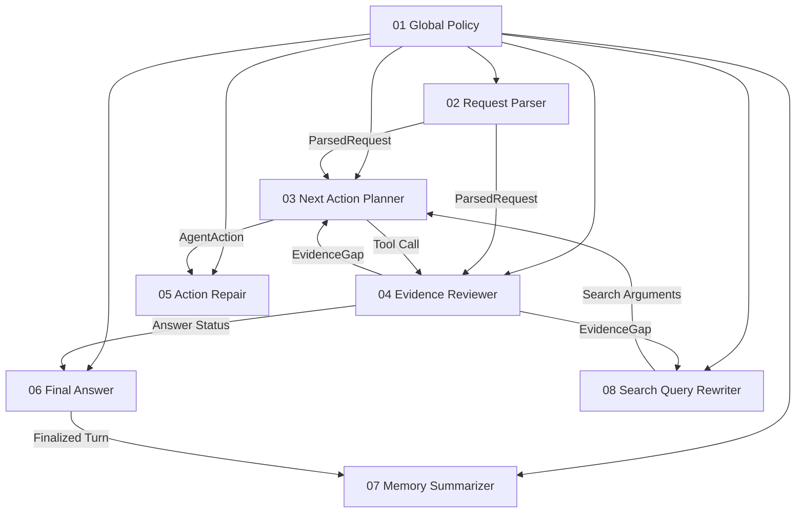

# 11｜Prompt Skills 与 Agent 决策提示词体系

> 本页定义 FinTrace 在线 Agent 的 Prompt / Skill 文件体系、依赖关系、加载顺序和版本约束。目标不是构建一个万能 Prompt，而是让每个 LLM 节点只承担一个清晰职责，并通过结构化数据契约连接。
> 

## 一、推荐文件结构

```
prompts/
├── 00_prompt_manifest.md
├── 01_global_policy.md
├── 02_request_parser.md
├── 03_next_action_planner.md
├── 04_evidence_reviewer.md
├── 05_action_repair.md
├── 06_final_answer.md
├── 07_memory_summarizer.md        # optional
└── 08_search_query_rewriter.md    # optional
```

## 二、核心依赖原则

**禁止 Skill Prompt 之间互相复制全文。**

运行时由统一 `PromptAssembler` 组装：

```
System Prompt
= 01_global_policy.md
+ 当前 Skill Prompt
+ 当前节点动态约束

User / Context Payload
= ParsedRequest / CurrentContext / Capability / Evidence / ToolHistory 等结构化数据
```

因此，“依赖”主要是**数据契约依赖**，不是文本 include 依赖。

## 三、依赖图



## 四、文件职责

| 文件 | 职责 | 是否核心 |
| --- | --- | --- |
| `00_prompt_manifest.md` | 版本、依赖、加载顺序、数据契约 | 是 |
| `01_global_policy.md` | 所有 LLM 节点共享的金融事实与工具边界 | 是 |
| `02_request_parser.md` | 把自然语言解析成 ParsedRequest，不选工具 | 是 |
| `03_next_action_planner.md` | 复杂任务每次只决定一个下一动作 | 是 |
| `04_evidence_reviewer.md` | 判断证据覆盖与 Evidence Gap | 是 |
| `05_action_repair.md` | 只修复当前非法 Action，不重新自由规划 | 是 |
| `06_final_answer.md` | 只基于 Verified Claims / Evidence 生成用户答案 | 是 |
| `07_memory_summarizer.md` | 更新长对话结构化记忆 | 可选 |
| `08_search_query_rewriter.md` | 将 Evidence Gap 转成 document_search 查询 | 可选 |

## 五、调用关系

### Request Parser

```
01_global_policy
+ 02_request_parser
+ query
+ recent_context
+ deterministic entity/time candidates
→ ParsedRequest
```

### Next Action Planner

```
01_global_policy
+ 03_next_action_planner
+ ParsedRequest
+ CurrentContext
+ CandidateCapabilities
+ EvidenceLedger
+ EvidenceGaps
+ ToolHistory
+ RemainingBudget
→ AgentAction
```

### Evidence Reviewer

```
01_global_policy
+ 04_evidence_reviewer
+ ParsedRequest
+ VerifiedClaims
+ EvidenceLedger
+ ToolHistory
→ EvidenceReview
```

### Action Repair

```
01_global_policy
+ 05_action_repair
+ FailedAction
+ ValidatorError
+ CapabilityDefinition
+ ParsedRequest
→ RepairedAction / NotRepairable
```

### Final Answer

```
01_global_policy
+ 06_final_answer
+ Query
+ ResolvedContext
+ AnswerStatus
+ VerifiedClaims
+ Evidence
+ Limitations
→ FinalAnswer
```

### Optional Skills

`07_memory_summarizer` 仅在一个 Turn 完成后运行；`08_search_query_rewriter` 仅在 Planner 已决定使用 `document_search` 且查询需要语义改写时运行。

## 六、非 Prompt 依赖

以下内容**不应做成 Skill Prompt**，而应由程序动态注入：

- Capability Registry；
- Tool Schema；
- `knowledge_cutoff`；
- Entity Alias Index；
- Metric Registry；
- Tool Call Budget；
- Validator Rules；
- 当前已启用 / 未实现的 operation。

Prompt 不应硬编码系统“当前已经实现”的工具状态，否则代码更新后容易产生能力漂移。

## 七、版本规则

建议每个文件头部保留：

```yaml
prompt_id: fintrace.<skill_name>
version: 1.0.0
depends_on:
  - fintrace.global_policy@1.x
output_schema: <PydanticModel>
```

Trace 中记录：

```
prompt_id
prompt_version
model_name
input_hash
output_schema_version
```

这样才能对 Prompt 进行独立回放、A/B Test 和版本归因。

[00｜Prompt Manifest 与依赖规范](11%EF%BD%9CPrompt%20Skills%20%E4%B8%8E%20Agent%20%E5%86%B3%E7%AD%96%E6%8F%90%E7%A4%BA%E8%AF%8D%E4%BD%93%E7%B3%BB/00%EF%BD%9CPrompt%20Manifest%20%E4%B8%8E%E4%BE%9D%E8%B5%96%E8%A7%84%E8%8C%83%203c13854bbee98181a18dfde51af6c7ba.md)

[01｜Global Policy](11%EF%BD%9CPrompt%20Skills%20%E4%B8%8E%20Agent%20%E5%86%B3%E7%AD%96%E6%8F%90%E7%A4%BA%E8%AF%8D%E4%BD%93%E7%B3%BB/01%EF%BD%9CGlobal%20Policy%203c13854bbee981c78d1ddcfd45186a7f.md)

[02｜Request Parser Skill](11%EF%BD%9CPrompt%20Skills%20%E4%B8%8E%20Agent%20%E5%86%B3%E7%AD%96%E6%8F%90%E7%A4%BA%E8%AF%8D%E4%BD%93%E7%B3%BB/02%EF%BD%9CRequest%20Parser%20Skill%203c13854bbee9810dba98fb4b83b201fb.md)

[03｜Next Action Planner Skill](11%EF%BD%9CPrompt%20Skills%20%E4%B8%8E%20Agent%20%E5%86%B3%E7%AD%96%E6%8F%90%E7%A4%BA%E8%AF%8D%E4%BD%93%E7%B3%BB/03%EF%BD%9CNext%20Action%20Planner%20Skill%203c13854bbee981a8a2d2fb45ea89ada9.md)

[04｜Evidence Reviewer Skill](11%EF%BD%9CPrompt%20Skills%20%E4%B8%8E%20Agent%20%E5%86%B3%E7%AD%96%E6%8F%90%E7%A4%BA%E8%AF%8D%E4%BD%93%E7%B3%BB/04%EF%BD%9CEvidence%20Reviewer%20Skill%203c13854bbee981008e9edc0f32953e78.md)

[05｜Action Repair Skill](11%EF%BD%9CPrompt%20Skills%20%E4%B8%8E%20Agent%20%E5%86%B3%E7%AD%96%E6%8F%90%E7%A4%BA%E8%AF%8D%E4%BD%93%E7%B3%BB/05%EF%BD%9CAction%20Repair%20Skill%203c13854bbee981358ad0fb89ce1ad19f.md)

[06｜Final Answer Skill](11%EF%BD%9CPrompt%20Skills%20%E4%B8%8E%20Agent%20%E5%86%B3%E7%AD%96%E6%8F%90%E7%A4%BA%E8%AF%8D%E4%BD%93%E7%B3%BB/06%EF%BD%9CFinal%20Answer%20Skill%203c13854bbee9814cacf3eb18e078105d.md)

[07｜Memory Summarizer Skill（可选）](11%EF%BD%9CPrompt%20Skills%20%E4%B8%8E%20Agent%20%E5%86%B3%E7%AD%96%E6%8F%90%E7%A4%BA%E8%AF%8D%E4%BD%93%E7%B3%BB/07%EF%BD%9CMemory%20Summarizer%20Skill%EF%BC%88%E5%8F%AF%E9%80%89%EF%BC%89%203c13854bbee98126b6bff7bf59e69e45.md)

[08｜Search Query Rewriter Skill（可选）](11%EF%BD%9CPrompt%20Skills%20%E4%B8%8E%20Agent%20%E5%86%B3%E7%AD%96%E6%8F%90%E7%A4%BA%E8%AF%8D%E4%BD%93%E7%B3%BB/08%EF%BD%9CSearch%20Query%20Rewriter%20Skill%EF%BC%88%E5%8F%AF%E9%80%89%EF%BC%89%203c13854bbee981468b4cd4c8b0ee35e9.md)

## 运行时依赖图

```
                     01 Global Policy
                            │
          ┌─────────────────┼─────────────────┐
          │                 │                 │
          ▼                 ▼                 ▼
02 Request Parser    03 Next Action      06 Final Answer
          │              Planner               ▲
          │                 │                   │
          ▼                 ▼                   │
    ParsedRequest       AgentAction             │
          │                 │                   │
          └────────────┐    ▼                   │
                       │  Tool / Evidence       │
                       │       │                │
                       │       ▼                │
                       └──► 04 Evidence Reviewer
                                  │
                       ┌──────────┴──────────┐
                       │                     │
                    sufficient            gap exists
                       │                     │
                       └──────────────► 03 Next Action

05 Action Repair：仅挂在 Action Validator 失败分支。
07 Memory Summarizer：仅在本轮结束后运行。
08 Search Query Rewriter：仅在 Planner 已决定调用 document_search 后运行。
```

## Prompt Assembler 推荐实现

```python
SKILL_FILES = {
    "request_parser": "02_request_parser.md",
    "next_action_planner": "03_next_action_planner.md",
    "evidence_reviewer": "04_evidence_reviewer.md",
    "action_repair": "05_action_repair.md",
    "final_answer": "06_final_answer.md",
    "memory_summarizer": "07_memory_summarizer.md",
    "search_query_rewriter": "08_search_query_rewriter.md",
}

def build_system_prompt(skill_name: str) -> str:
    global_policy = load_prompt("01_global_policy.md")
    skill_prompt = load_prompt(SKILL_FILES[skill_name])
    return f"{global_policy}\n\n--- CURRENT SKILL ---\n\n{skill_prompt}"
```

动态输入必须独立于 Prompt 文件，通过结构化 Runtime Context 注入。不要把用户问题、Capability Registry、Tool Schema、Evidence 或 `knowledge_cutoff` 写死在 md 文件里。

## 推荐调用顺序

```
简单请求：
Deterministic Entity/Time Parsing
→ Request Parser（必要时）
→ Pre-Answerability
→ Direct Gate
→ Tool
→ Evidence Sufficiency
→ Final Answer

复杂请求：
Request Parser
→ Pre-Answerability
→ Next Action Planner
→ Validator
→ Tool
→ Evidence Reviewer
   ├─ continue → Next Action Planner
   ├─ sufficient → Final Answer
   ├─ partial → Final Answer
   └─ insufficient → Final Answer

异常分支：
Validator Error
→ Action Repair
→ Validator

文档检索增强：
Next Action Planner decides document_search
→ Search Query Rewriter（可选）
→ document_search

本轮结束：
Final Answer
→ Memory Summarizer（可选）
→ Persist Session
```

## 版本约束

Prompt 文件应独立版本化。修改 `01_global_policy.md` 视为高影响变更，因为它会影响全部 Skill；修改单个 Skill 只需重点回归对应节点评测。

建议发布策略：

```
patch：措辞优化，不改变决策边界
minor：增加字段、规则或 few-shot，但保持兼容
major：修改输入/输出 Schema 或 Skill 职责边界
```

每次运行 Trace 应记录 `prompt_id + prompt_version + model + schema_version`，从而支持 Prompt A/B、错误归因和复现实验。